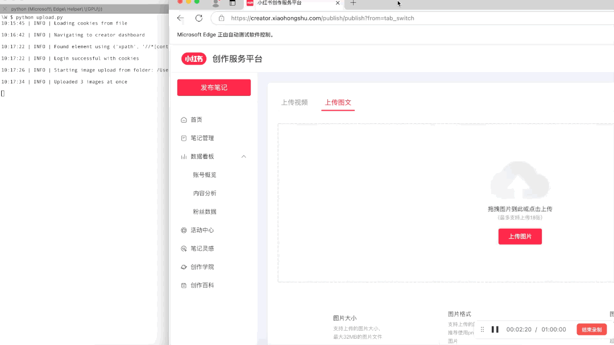

# 小红书自动发布工具

基于Selenium的小红书内容自动发布工具，支持视频和图文定时发布。

## 🎬 演示效果


## 🚀 功能特性
- 支持视频/图文笔记发布
- 定时发布功能（每日20:00）
- Cookie持久化登录
- 自动重试和错误日志记录
- 支持Headless模式运行

## 📦 安装
```bash
# 安装依赖
pip install -r requirements.txt

# 安装Edge浏览器（需先安装）
https://www.microsoft.com/zh-cn/edge
```

🛠️ 使用方法
配置cookies路径（首次需要手动登录）：
```python
XIAOHONGSHU_COOKIE_PATH = "your_path/cookies.json"  # 修改为实际路径
```
运行主程序：

```python
python upload.py
```
⚙️ 文件结构

```plainText
├── upload.py            # 主程序
├── requirements.txt     # 依赖库
├── logs/                # 运行日志
└── errors/              # 错误截图和页面源码
```

📌 注意事项
- 首次运行会弹出浏览器窗口，请手动登录小红书创作者平台
- 图片/视频路径需使用您自己的路径
- 定时发布时间为每日20:00（可在_get_publish_date方法中修改）
- 确保网络稳定，上传大文件时请耐心等待

🤝 贡献
欢迎提交Issue和PR，请遵守小红书平台规则

